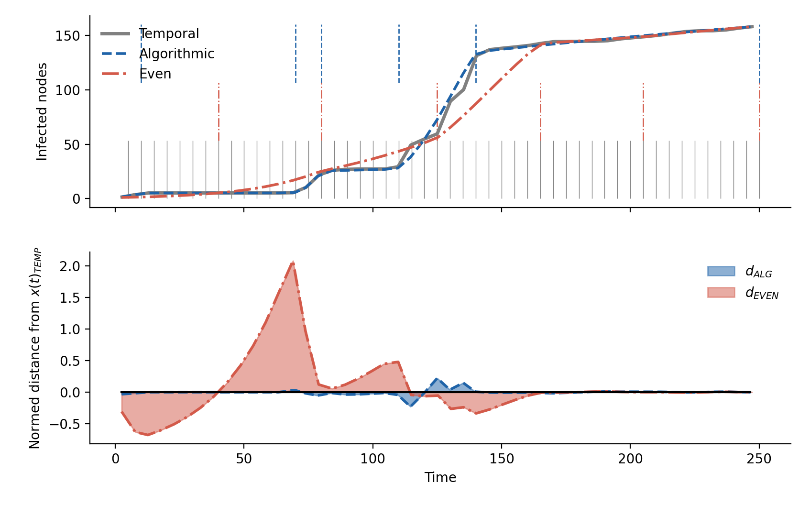

# network-compression

Repository includes source code and supporting work for manuscript in preparation.

## src/temporalnetwork.py
Includes source code for temporal network and snapshot objects.

## src/compression.py
Objects for performing algorithmic compression of temporal networks.

## src/solvers.py
Source code for initializing and solving a deterministic system
of ordinary differential equations of an SI spreading process on
a temporal network.

## manuscript/
Contains supporting computations, experiments, and plotting code
for manuscript (in preparation).

Please contact Andrea Allen at andrea2allen (at) gmail.com for use questions.

Use examples: 

See `manuscript/synthetic_demos.py` for demonstration.

The figure above shows an example application of the temporal compression framework
(see [`manuscript/synthetic_demos.py`](./manuscript/synthetic_demos.py) for the source code).
Here, we begin with 50 snapshots each with a slightly different random network
generated from a collection of motifs (Erdos-Renyi, Barbell graphs, configuration models, etc.)
inidicated by the grey lines in the top panel.

First using an even segmentation strategy to compress the snapshots, the red dashed lines
in the top panel show the new boundaries of the compressed snapshots. Then, using
our compression algorithm, the blue dashed lines show the boundaries of the compressed
networks under our algorithm.

The grey time series in the top panel is the solution of a disease spread process
on the original temporal network, where the network is switched at each time increment.
The blue and red dashed lines show the disease spread time series solution on the resulting
snapshots from the two compression regimes, even segmentation vs. our algorithm.

The lower panel shows the integral of the error between the red and blue time series and the
grey temporal solution. You can see that the algorithmic compression performs
much closer to the original fully temporal dynamics than an even compression.

# TODO cite the original data